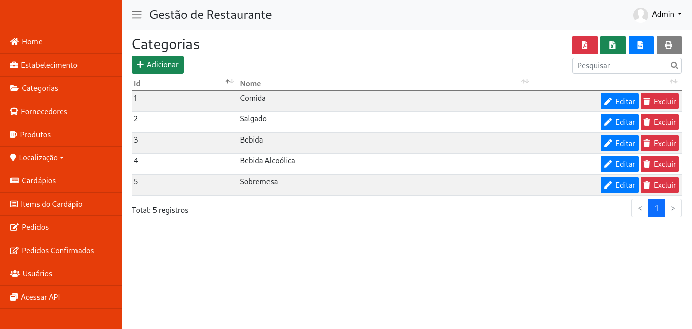
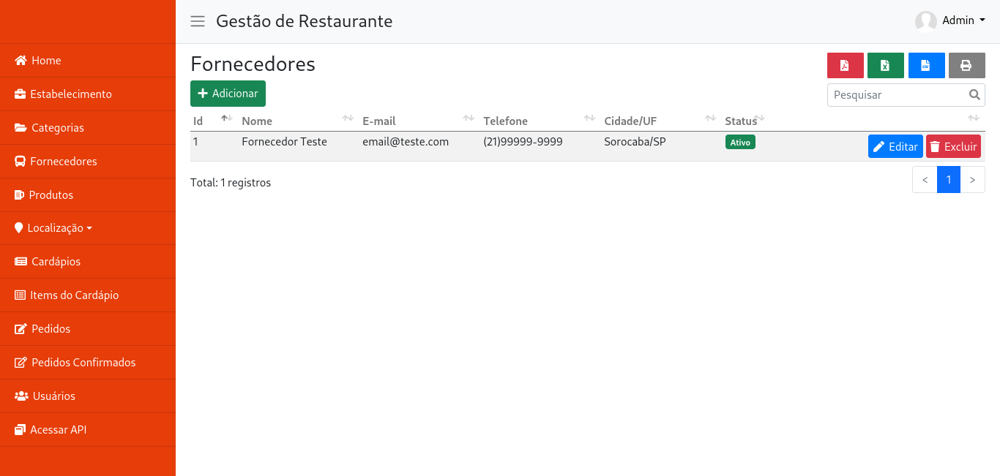
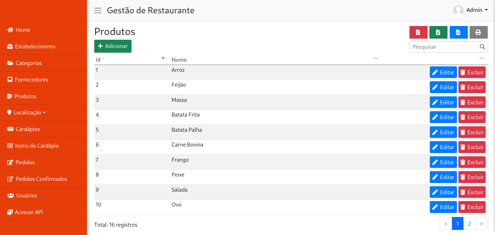
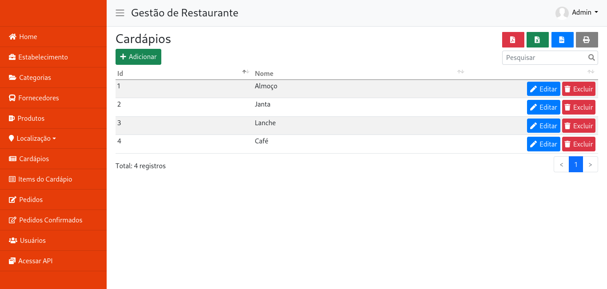
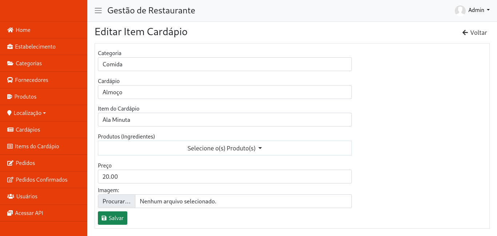
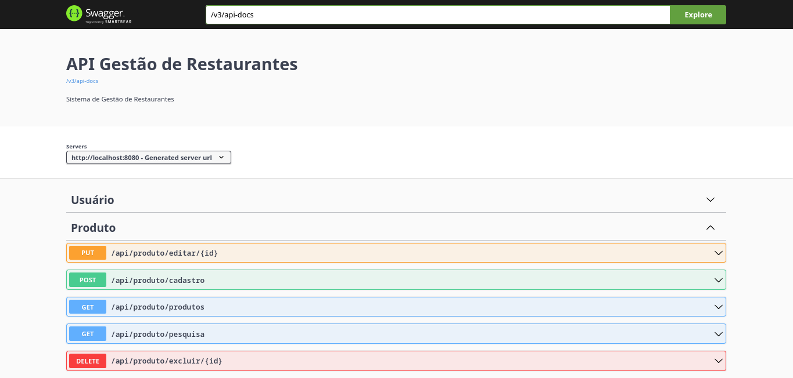

# Gestão de Restaurante

Sistema para gestão de restaurante desenvolvido em Java com Spring Boot e API REST.

## Módulos

- Login
- Estabelecimentos
- Categorias
- Fornecedores
- Produtos
- Cardápios
- Itens do Cardápio
- Estados
- Municípios
- Bairros
- Pedidos
- Pedidos Confirmados
- Usuários

## Requisitos

- Java JDK >= 17
- Apache Maven >= 3.8.6
- MySql 8.0.30
- Docker (Opcional)

## Tecnologias

- Java
- JPA
- Maven
- Lombok
- Spring Boot
- Thymeleaf
- Bootstrap
- DataTables
- Json
- MySql
- Swagger
- Docker-Compose

## Instalação

### Docker
Abra o terminal e execute o seguinte comando:

```
$ docker-compose up
```

OBS: É necessário ter o Docker e docker-compose instalado.
Caso não tenha instalado o Docker ou dê alguma falha na instalação, tente com os comandos abaixo.

### MySql
Crie um banco de dados com o nome "restaurante" no seu Mysql.<br>
Abra o arquivo .env e efetue a configuração correta para conexão do seu banco de dados.<br>

```
$ mysql -u<seu usuário> -p<sua senha>

mysql> create database `restaurante`;
```

### Maven
Para rodar o projeto com Maven, é necessário ter a versão 3.8.6 instalada.<br>
Além disso, é preciso ter o Java 15 e o MySql 8 instalado.<br>

Tendo tudo instalado e rodando localmente, basta executar o seguinte comando:

```
$ cd sistema-gestao-restaurante
$ mvn clean spring-boot:run -Dspring-boot.run.profiles=dev
```

## Acesso ao Sistema

Para acessar o sistema utilize o seguinte endereço:<br>
http://localhost:8080/

Usuário: admin<br>
Senha: admin 

## Acesso ao Swagger

Para acessar o Swagger utilize o seguinte endereço:<br>
http://localhost:8080/swagger-ui.html

## Licença

Projeto licenciado sob <a href="LICENSE">The MIT License (MIT)</a>.<br><br>

## Screenshots

 <br><br>
 <br><br>
 <br><br>
 <br><br>
 <br><br>
 <br><br>
 <br><br>
 <br><br>
 <br><br>
 <br><br>
 <br><br>
 <br><br>
 <br><br>
 <br><br>
 <br><br>
 <br><br>

* Fotos dos Itens do Cardápio meramente ilustrativas.<br><br>


Desenvolvido por<br>
Danilo Meneghel<br>
danilo.meneghel@gmail.com<br>
http://danilomeneghel.github.io/<br>
